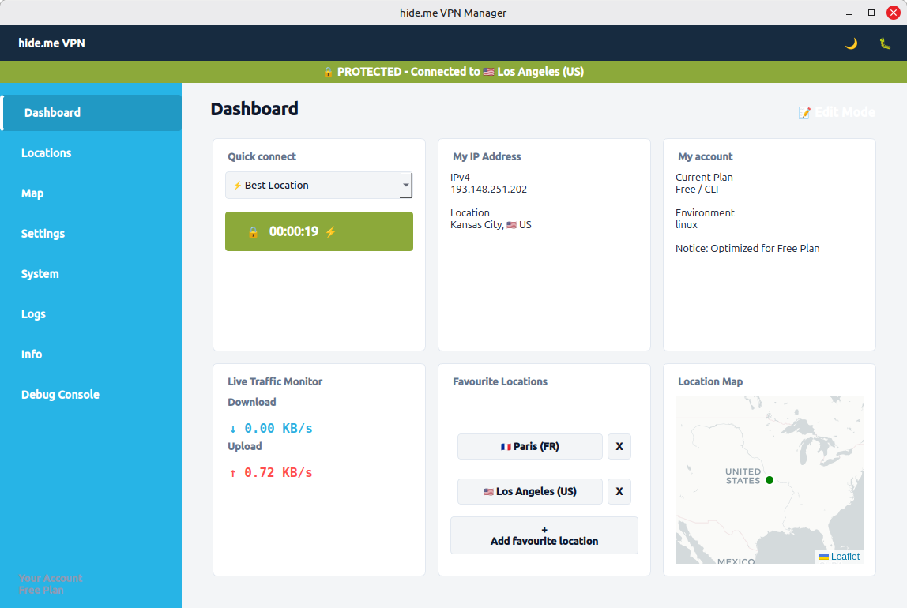

# 🛡️ hide.me VPN Manager GUI (Linux)



A modern, highly interactive, and feature-rich Graphical User Interface (GUI) for the official **hide.me VPN Linux CLI**. Built with Python and PyQt6, this application seamlessly bridges the raw power of the terminal with a beautiful, customizable desktop experience.

## 📖 The Story Behind This Project

This project was born out of a simple need: **I wanted a comfortable, graphical way to use the official hide.me CLI on Linux.** 
While the command-line interface provided by hide.me is incredibly powerful and fast, manually managing WireGuard connections, configuring split tunneling, and toggling kill switches via terminal commands isn't always the most convenient workflow for daily desktop use. 

I envisioned a modern dashboard that brings all these CLI features into a clean, mouse-driven interface without losing the underlying security and performance of the official client.

🧠 **AI-Assisted Development:** 
This entire application—from the PyQt6 interface and interactive Leaflet mapping to the complex subprocess management and deep IPv4/IPv6 routing cleanups—was extensively designed, written, and refined with the help of **Gemini 3.1 Pro Thinking**. It stands as a great example of how advanced AI reasoning can help bridge the gap between complex CLI tools and user-friendly desktop applications.

---

## ✨ Key Features

### 🎛️ Customizable Dashboard
* **Modular Grid System:** Personalize your home screen with a 6-slot grid. Choose between widgets like *Quick Connect*, *My IP Address*, *Live Traffic Monitor*, *Mini Map*, *Favourite Locations*, and more.
* **Live Network Traffic:** Real-time download and upload speed monitoring directly on the dashboard.

### 🌍 Interactive Map & Server Selection
* **Integrated Leaflet Map:** Visualizes all available hide.me servers. Your current unencrypted location is marked in red, and your secure VPN location turns green upon connection.
* **Smart Pinging & Best Location:** Run latency tests to find the fastest server, or let the app automatically calculate and connect to the "Best Location".
* **Favourites System:** Save your most used servers for one-click connections.

### 🛡️ Uncompromised Security & Privacy
* **Native Kill Switch:** Easily toggle IP leak protection.
* **LAN Bypass:** Maintain access to your local network devices (printers, NAS) while the VPN is active.
* **StealthGuard & Server Filters:** Turn on hide.me's built-in DNS filters with simple checkboxes: Block Ads, Trackers, Malware, Malicious sites, Illegal content, and enforce SafeSearch.
* **Custom Split Tunneling:** Exclude specific external IP addresses or whole subnets from the VPN tunnel.

### ⚙️ Expert Routing Engine (V51)
* **Deep Network Cleanup:** The app uses a robust background algorithm to safely terminate the CLI and flush dangling `WireGuard` interfaces, as well as `IPv4` and `IPv6` routing tables (`table 55555`). This completely eliminates the dreaded `addition failed: file exists` error when rapidly switching servers.
* **Protocol Selection:** Force IPv4 or IPv6 connections.
* **Advanced DNS:** Disable DNS-over-HTTPS (DoH), force DNS handling on the VPN server, or inject custom DNS servers.
* **Custom WireGuard Parameters:** Set custom interface names (`-i`), listen ports (`-l`), and Dead Peer Detection timeouts (`--dpd`).

---

## 📋 Prerequisites & Dependencies

Because this application functions as a wrapper for the official client and modifies network interfaces, routing tables, and DNS settings, it **requires a Linux environment and root (`sudo`) privileges.**

* **OS:** Linux (Tested on Ubuntu/Debian-based distributions)
* **Python:** Python 3.8 or higher
* **hide.me CLI:** The app will automatically download and install the official CLI via the hide.me install script if it isn't found on your system.

### Libraries
The app includes an **auto-installer** that will attempt to fetch missing packages on the first run. If you prefer to install them manually:
```bash
sudo apt update
sudo apt install python3-pyqt6 python3-pyqt6.qtwebengine python3-requests fonts-noto-color-emoji
```

---

## 🚀 Installation & Usage

1. **Clone the repository:**
   ```bash
   git clone https://github.com/basecore/hideme-vpn-manager.git
   cd hideme-vpn-manager
   ```

2. **Launch the Application:**
   Run the Python script with `sudo` to grant the necessary permissions for the WireGuard interface creation:
   ```bash
   sudo python3 hideme_gui.py
   ```

3. **Desktop Integration (Optional):**
   You can leave the app running in the background. It supports System Tray integration (minimize to taskbar) and utilizes native Linux `notify-send` for desktop connection alerts.

---

## 🛠️ Troubleshooting

* **VPN hangs on "Connecting..." or shows "file exists" errors:**
  This usually happens if the CLI crashed previously and left zombie routes. Go to **Settings -> Expert** and click the red **⚠️ Emergency Network Reset (Fix Internet)** button. This will forcefully flush all VPN-related `ip route` and `ip rule` entries.
* **Map card is completely blank:** 
  Ensure that `python3-pyqt6.qtwebengine` is correctly installed on your system.
* **Visual glitches on checkboxes or buttons:**
  The app uses the native Qt `Fusion` style to ensure a uniform, clean look across different desktop environments (GNOME, KDE, XFCE). Ensure your system's Qt6 libraries are up to date.

---

## 🤝 Contributing & Bug Reports

Contributions, pull requests, and bug reports are highly appreciated! 
If you encounter any issues or have feature requests, please open an issue on the [GitHub Issues page](https://github.com/basecore/hideme-vpn-manager/issues).

---

## 📄 License & Disclaimer

*This project is open-source and created by a passionate user for the Linux community. It is an unofficial GUI wrapper and is **not** officially affiliated with, endorsed by, or maintained by hide.me VPN or eVenture Ltd. Use at your own risk.*
